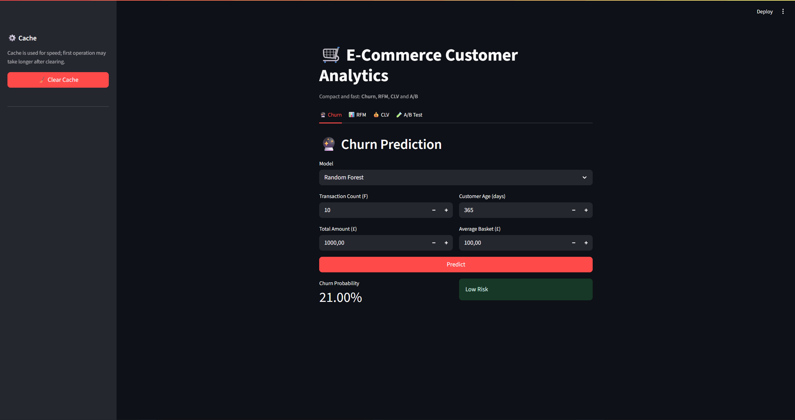
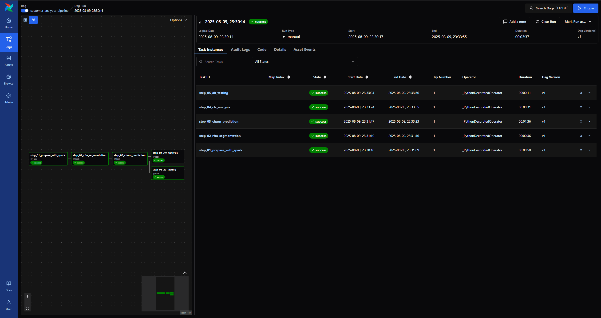
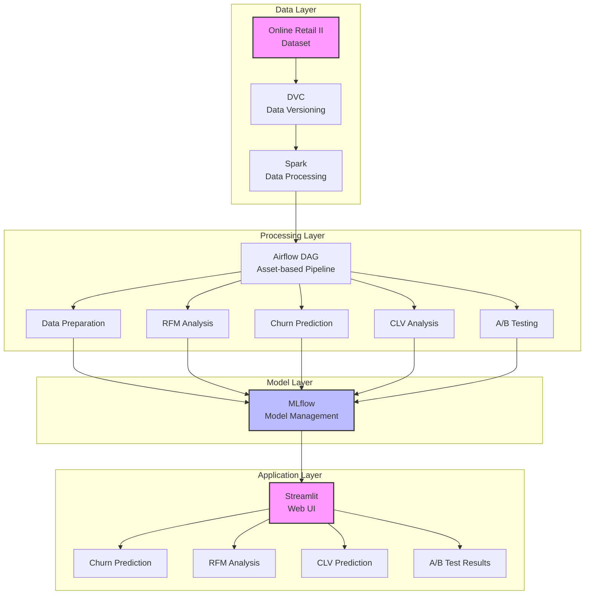

# E-Commerce Customer Analytics MLOps Pipeline

<div align="center">

  <a href="https://www.python.org/">
    
  </a>
  <a href="https://spark.apache.org/">
    
  </a>
  <a href="https://airflow.apache.org/">
    
  </a>
  <a href="https://mlflow.org/">
    
  </a>
  <a href="https://www.docker.com/">
    
  </a>
  <a href="https://streamlit.io/">
    
  </a>
  <a href="https://dvc.org/">
    
  </a>

</div>


## 📊 Project Overview

This project is a comprehensive **MLOps pipeline** for e-commerce customer analytics. Using the Online Retail II dataset, it analyzes customer behavior, performs customer segmentation, predicts churn, and calculates Customer Lifetime Value (CLV). All analyses run through an **automated pipeline** orchestrated by an **Airflow DAG**, with **MLflow** providing experiment tracking and model management, and are presented via a **modern Streamlit interface**.

<div align="center">

<table>
  <tr>
    <td align="center" width="50%">
      <br/>
      <span style="display: inline-block; margin-top: 8px; font-size: 1.1em; font-weight: 600; color: #FF4B4B;">
        🚀 Streamlit Interface
      </span>
    </td>
    <td align="center" width="50%">
      <br/>
      <span style="display: inline-block; margin-top: 8px; font-size: 1.1em; font-weight: 600; color: #017CEE;">
        ⚡ MLflow & Airflow Orchestration
      </span>
    </td>
  </tr>
</table>

</div>

---
## 🎯 Key Features & Goals

* **Data-Driven Decisions:** Analyze customer behavior to generate insights that help improve business strategy.
* **Automated ML Pipeline:** A fully orchestrated workflow from data ingestion and preparation to model training and evaluation.
* **Interactive Analytics:** A user-friendly interface for real-time customer analysis.
* **Robust Model Management:** Version and track model performance, parameters, and artifacts with MLflow.
* **Scalable Infrastructure:** Build a system capable of processing large-scale data using Spark and containerization.

---
## ✨ Tech Stack

This section lists the core technologies and methodologies underpinning the project.

### 🏗️ MLOps & Infrastructure

* **Docker & Docker Compose:** Containerization to run all services (Airflow, MLflow, Streamlit) in isolated, reproducible environments.
* **Apache Airflow:** Automation and orchestration of data processing and modeling steps using an `asset-based` approach.
* **MLflow:** Tracking and management of ML experiments, parameters, metrics, and models.
* **DVC (Data Version Control):** Versioning large datasets without committing them to Git.
* **Astro CLI:** Easily develop and manage the local Airflow environment.
* **Hydra:** Flexible management of pipeline parameters and configurations.

### 🔄 Data Processing & Analytics

* **Apache Spark:** Fast and efficient processing of large-scale datasets in a distributed environment.
* **RFM Analysis:** Segment customers by Recency, Frequency, and Monetary metrics.
* **A/B Testing:** Statistical hypothesis testing to measure how different strategies affect customer behavior.

### 🤖 Machine Learning

* **Churn Prediction (XGBoost & Random Forest):** Classification models that forecast customer attrition.
* **CLV (Customer Lifetime Value):** Models that estimate a customer's future value.
* **Customer Segmentation (K-Means):** Create persona groups based on RFM scores.

### 🌐 Presentation Layer

* **Streamlit:** Serve model predictions through an interactive web UI.
---


## 🚀 Setup & Run

### Requirements

* **Docker** & **Docker Compose**
* **Astro CLI (Windows):** `winget install -e --id Astronomer.Astro`
* **Git** and **DVC:** `pip install dvc`

### Setup Steps

#### 1. Clone the repository

```bash
git clone https://github.com/mertafacan/E-Commerce-Customer-Analytics-MLOps-Pipeline.git
cd E-Commerce-Customer-Analytics-MLOps-Pipeline
```

#### 2. Pull the dataset

Fetch the required dataset with DVC:

```bash
dvc pull
```

#### 3. Start the Airflow environment

This command brings up the Docker containers required for Airflow and related services:

```bash
astro dev start
```

#### 4. Start MLflow and Streamlit services

In a separate terminal, run the other services:

```bash
docker compose -f docker-compose.mlflow-streamlit.yml up --build
```

### Accessible Services

Once the project is up, the following services will be available:

* **MLflow UI:** [http://localhost:5000](http://localhost:5000)
* **Streamlit App:** [http://localhost:8501](http://localhost:8501)
* **Airflow UI:** [http://localhost:8080](http://localhost:8080)

---
## 🏗️ Project Architecture

###    🏛️ Overall Architecture





### 📁 Directory Structure

```
E-Commerce-Customer-Analytics-MLOps-Pipeline/
├── .dvc/                          # DVC metadata/remote settings
├── .dvcignore
├── .gitignore
├── airflow_settings.yaml          # Airflow configuration
├── docker-compose.mlflow-streamlit.yml  # MLflow + Streamlit service orchestration
├── docker-compose.override.yml    # Local network override
├── Dockerfile                     # Astro Airflow image
├── Dockerfile.mlflow              # MLflow image
├── packages.txt
├── poetry.lock
├── pyproject.toml                 # Project dependencies & build (Poetry)
├── requirements.txt               # Astro Airflow dependencies list
├── README.md
│
├── dags/                          # Airflow DAGs
│   ├── .airflowignore
│   └── customer_analytics_pipeline.py  # Main pipeline (asset-based)
│
├── data/
│   ├── .gitignore
│   └── online_retail_II.csv.dvc   # Raw data pointer (tracked by DVC)
│
├── include/                       # Analysis modules
│   ├── conf/
│   │   └── config.yaml            # Hydra configuration
│   ├── Data_Preparation.py        # Data preparation with Spark
│   ├── RFM_and_Segmentation.py    # RFM analysis and segmentation
│   ├── Churn_Prediction.py        # Churn prediction
│   ├── CLV_Analysis.py            # CLV calculation
│   └── AB_Testing.py              # A/B testing
│
├── streamlit/
│   ├── Dockerfile                 # Streamlit image
│   ├── app.py                     # Streamlit UI
│   ├── model_utils.py             # Helper functions for models
│   └── requirements.txt
│
├── plugins/
└── tests/
```

---
## 🧩 Core Components & Responsibilities

This section provides a detailed overview of the key components that make up this MLOps pipeline and their specific responsibilities within the system.

### 🔄 Pipeline Orchestration

**`dags/customer_analytics_pipeline.py`** is the central orchestration component of the project. This Airflow DAG defines the project's main workflow and connects all analytical steps as `assets`, creating a cohesive automated pipeline that coordinates the entire data processing and machine learning workflow.

### 📊 Analysis Modules

The **`include/`** directory contains Python modules with the core logic for each analytical task. These modules are invoked by the Airflow DAG and handle the data processing, model training, and analysis computations.

* **`Data_Preparation.py`**: Cleans and transforms raw data with Spark and prepares it for subsequent analytical steps.
* **`RFM_and_Segmentation.py`**: Performs RFM analysis and customer segmentation using K-Means clustering to create customer personas.
* **`Churn_Prediction.py`**: Implements churn prediction models using XGBoost and Random Forest algorithms to forecast customer attrition.
* **`CLV_Analysis.py`**: Calculates Customer Lifetime Value using lifetimes models (BetaGeoFitter and GammaGammaFitter) for 3, 6, and 12-month predictions.
* **`AB_Testing.py`**: Conducts statistical A/B testing using Mann-Whitney U tests to measure the impact of different strategies on customer behavior.
* **`conf/config.yaml`**: Contains all parameters used in the pipeline, including file paths, model hyperparameters, and configuration settings managed by Hydra.

### 🌐 User Interface

The **`streamlit/`** directory contains the interactive web application that presents analysis results and provides an interface for interacting with the trained models.

* **`app.py`**: The main Streamlit application file that provides the user interface for exploring analytics and model predictions.
* **`model_utils.py`**: Helper functions for loading models logged in MLflow and making predictions through the web interface.

### 🐳 Containerization

The containerization components enable environment-agnostic deployment and consistent execution across different systems.

* **`Dockerfile`**: Configuration for building the Astro Airflow image.
* **`Dockerfile.mlflow`**: Configuration for building the MLflow image.
* **`docker-compose.mlflow-streamlit.yml`**: Orchestrates the MLflow and Streamlit services, enabling one-command execution of all components.

### 📦 Data Management

* **`data/online_retail_II.csv.dvc`**: A metadata file tracked by DVC that points to a specific version of the dataset instead of storing it directly. The `dvc pull` command uses this pointer to download the required data.

### ⚙️ Dependencies

* **`pyproject.toml` and `requirements.txt`**: Define the project's Python libraries and dependencies, ensuring consistent environments across development and production.

---
## 📬 Contact

Mert Afacan – [https://www.linkedin.com/in/mert-afacan/](https://www.linkedin.com/in/mert-afacan/) – [mert0afacan@gmail.com](mailto:mert0afacan@gmail.com)